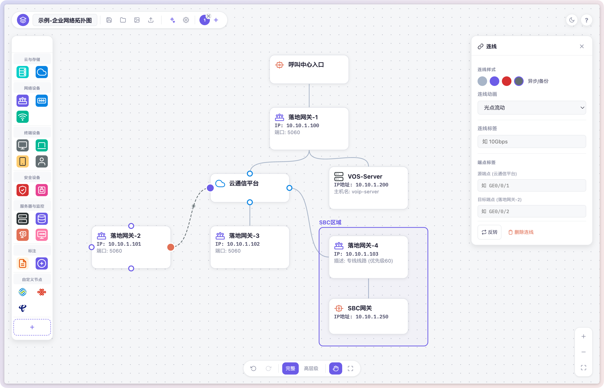
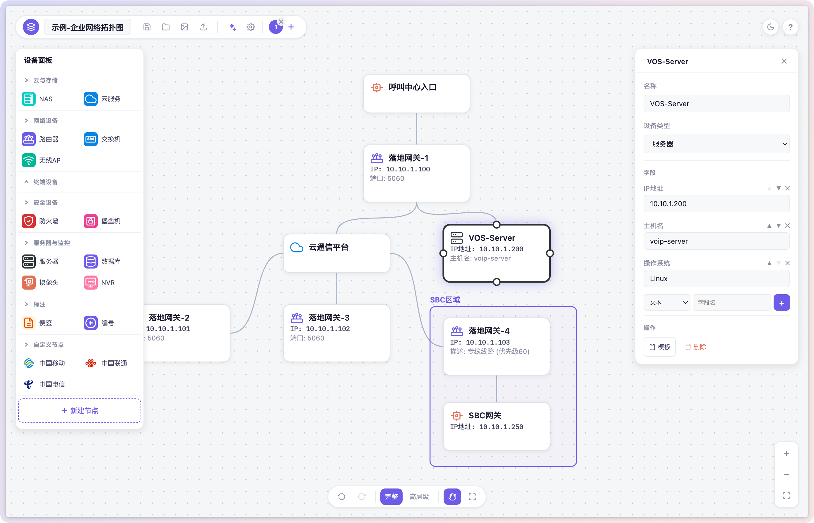

# NetDraw

一个轻量级的网络拓扑图绘制工具，单个 HTML 文件即可运行，无需服务器、无需安装。

  
  

## 特性

**AI 识别生成** — 上传拓扑图截图或输入文字描述，AI 自动识别设备、连线和分组，生成可编辑的拓扑图。支持通义千问、豆包、OpenAI、SiliconFlow、Ollama 等多种模型。

**本地优先** — 所有数据保存在浏览器 localStorage，不上传任何服务器。可以放心地画包含 IP 地址、设备型号的生产环境拓扑图，数据不会离开你的电脑。

**单文件交付** — 整个工具就是一个 `netdraw.html`，零依赖、零配置。可以部署到任何 Web 服务器、NAS，甚至直接双击打开。

**17 种设备类型** — 光猫、路由器、交换机、AP、摄像头、NAS、防火墙、服务器、云服务……每种都有专属图标和预设字段，覆盖常见网络设备。支持自定义设备类型，设置专属图标、颜色和预设字段。

**自定义字段** — 每个节点可以自由添加字段：IP 地址、端口、MAC、机房位置、负责人……支持文本、多行文本、数字、下拉选择、日期、链接、开关等多种类型。

**多画布管理** — 一个文件里可以保存多张拓扑图，通过底部标签切换，适合管理不同项目的网络架构。

**连线样式** — 四种连线样式（默认、主干链路、安全链路、异步/备份），两种动画效果（光点流动、虚线流动），让拓扑图一目了然。

**智能排版** — 自动排版根据连线关系分析层级结构，一键对齐所有设备。选中多个对象后可以水平/垂直对齐、等间距分布。

**导出能力** — 支持导出 SVG（矢量）、PNG（位图）和 JSON（可重新导入编辑），适配文档、汇报、存档等不同场景。

## 快速开始

1. 下载 `netdraw.html`
2. 用浏览器打开
3. 从左侧面板拖拽设备到画布，点击设备添加连线
4. 完成后点击导出按钮保存

### AI 识别

1. 点击工具栏的 AI 按钮
2. 填入 API Key（支持通义千问、豆包等）
3. 上传拓扑图截图或输入文字描述
4. AI 会自动识别设备、连线和分组，生成可编辑的拓扑图

## 更新方法

下载最新版本的 `netdraw.html`，替换本地文件即可。你的拓扑图数据存在浏览器里，替换文件不会丢失。

更新日志见 [CHANGELOG.md](CHANGELOG.md)。

## 技术细节

- 纯前端实现，无任何外部依赖
- SVG 绘制，支持无损缩放
- 键盘快捷键：Ctrl+Z 撤销、Ctrl+Y 重做、Ctrl+S 保存、Delete 删除
- 支持拖拽框选、多选对齐、批量操作
- 暗色/亮色主题

## License

[MIT](https://opensource.org/licenses/MIT)

## Author

scomper

## 赞助

如果觉得项目不错，可以请 scomper 喝杯咖啡 ☕。

  

